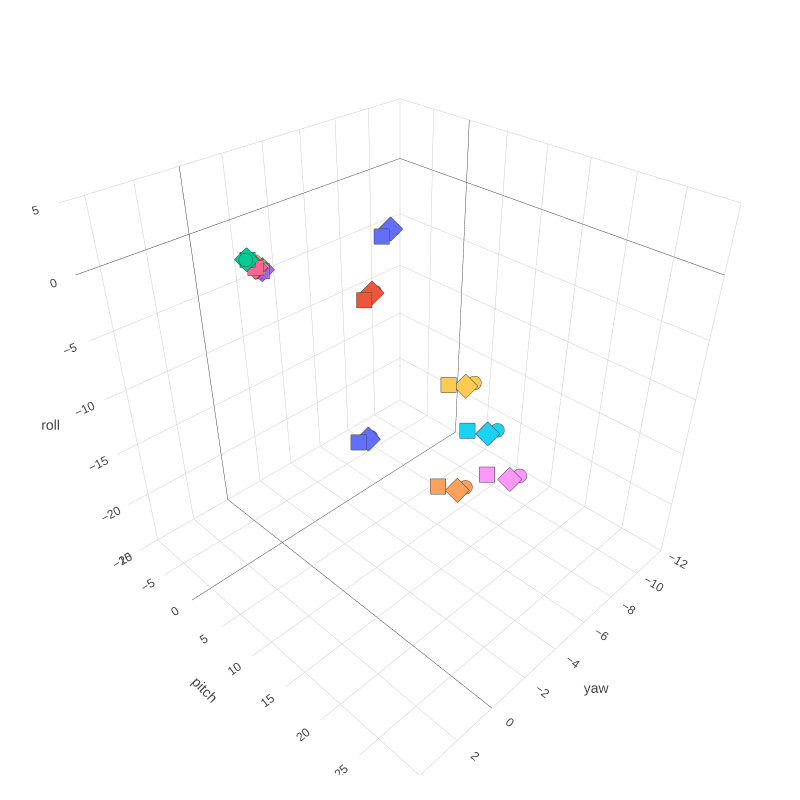

# Describing domain orientation in &beta;-Phosphoglucomutase using Euler angles

Scripts used for the calculation of intrinsic Euler angle representations of domain orientation in &beta;PGM.

These scripts were used in the work conducted for the research article titled: "Peri active site catalysis of proline isomerisation is the molecular basis of allomorphy"

## 1 Domain Euler Angle Calculation Details

 * &beta;-Phosphoglucomutase from lactococcus lactis has a cap domain (residues T16-V87) and a core domain (residures M1-D15, S88-K221).

 * Domain orientation in &beta;-Phosphoglucomutase can be defined relative to a reference structure. The natural choice of reference is the canonical cisP &beta;PGM:MgF3G6P, fully closed, transition state analogue, crystal structure (PDB 2WF5). Euler angles are used here to describe deviations from this fully-closed conformational state.

 * The calculated angles (and the conformational changes they represent) are very sensitive to the coordinate basis. We chose to use the principal axes of the reference structure's cap domain as a coordinate basis. In this context, the pitch angle represents a domain opening/closing motion, the roll angle represents a twisting motion and the yaw angle represents a left-to-right lateral rotation.
 
 * The calculation of Euler angles is summarised as follows...
    1. The reference structure is aligned to the principal axes derived from the positional distribution of C&alpha; atoms in its cap domain.
    2. The query structure is aligned to the core domain of the reference structure.
    3. The query structure is subsequently aligned to the cap domain of the reference structure.
    4. The rotation matrix associated with the transition from a cap-aligned structure to a core-aligned structure is used to calculate the three intrinsic Euler angles (pitch, roll and yaw).

## 3 Example Usage

A working example can be found in the "**./example**" directory

#### 3.1 Set up a python environment...
This program was developed using  <code>python version=3.8.18</code> with the following libraries:
<pre><code>MDAnalysis  version=2.4.3</code>
<code>Biopython   version=1.81</code> 
<code>Scipy       version=1.10.1</code> 
<code>Numpy       version=1.24.4</code> 
<code>Pandas      version=2.0.3</code></pre>

You can create a compatible python environment by [installing anaconda](https://docs.anaconda.com/free/anaconda/install/index.html) or [miniconda](https://docs.conda.io/projects/miniconda/en/latest/index.html#quick-command-line-install) and running the following command...

<pre><code>conda create --name EulerAngleEnv --file ./environment.yml</code></pre>

Run the following command to activate the environment...

<pre><code>conda activate EulerAngleEnv </code></pre>

Alternatively, a pre-compiled stand-alone executable has been made for each of the python scripts included in this repository.

#### 3.2 Get Input Structures
The following &beta;PGM structures were downloaded from the [Protein Data Bank](https://www.rcsb.org/) and saved in "./example/input/".
<pre>
    1lvh    2wf6    3zi4    5ok0    6h8v    6h93    6hdk    6ydl
    1o03    2wf7    4c4r    5ok1    6h8w    6h94    6hdl    6ydm
    1o08    2wf8    4c4s    5ok2    6h8x    6hdf    6hdm    8q1c
    1z4n    2wf9    4c4t    5olw    6h8y    6hdg    6i03    8q1d
    1z4o    2wfa    5o6p    5olx    6h8z    6hdh    6qzg    8q1e
    1zol    2whe    5o6r    5oly    6h90    6hdi    6ydj    8q1f
    2wf5    3fm9    5ojz    6h8u    6h91    6hdj    6ydk
</pre>
#### 3.3 Select Protein Chains
The program requires a file specifying a list of query structures (e.g. "./example/queryStructures"). Each line should specify a protein structure file and a chain identifier. These values should be white-space separated (i.e. spaces or tabs).
<pre>
./inputs/pdb1lvh.pdb    A
./inputs/pdb1lvh.pdb    B
./inputs/pdb1o03.pdb    A
./inputs/pdb1o08.pdb    A
./inputs/pdb1z4n.pdb    A
./inputs/pdb1z4n.pdb    B
./inputs/pdb1z4o.pdb    A
./inputs/pdb1z4o.pdb    B
./inputs/pdb1zol.pdb    A
./inputs/pdb2wf5.pdb    A
</pre>

#### 3.4 Prepare a Reference Structure
The calculated euler angles are very sensitive to the reference frame. An appropriate reference frame must be chosen in order to obtain interpretable values for each of the three euler angles. In this example, we use the principal axes of inertia of the reference structure's cap domain.

A python program is included which aligns a structure to the principal axes of a user-defined atom selection.
<pre><code># set working directory
cd ./example

# create a folder to store outputs
mkdir -p outs

# run python script
python ../alignPrincipalAxes/alignPrincipalAxes.py --infile ./inputs/pdb2wf5.pdb \
                                                   --select "protein and resid 16:87 and name CA" \
                                                   --outfile ./outs/pdb2wf5_PAaligned.pdb
</code></pre>

This script is also available as a pre-compiled, stand-alone executable, which can be run in a similar way...

<pre><code>../alignPrincipalAxes/alignPrincipalAxes --infile ./inputs/pdb2wf5.pdb \
                                         --select "protein and resid 16:87 and name CA" \
                                         --outfile ./outs/pdb2wf5_PAaligned.pdb
</code></pre>

#### *Arguments*
<code> --infile</code> 
A string specifying the file path of the input structure.

<code> --select</code>
A string specifying the atoms used for the principal axes alignment. This should adhere to the [MDAnalysis atom selection language](https://userguide.mdanalysis.org/stable/selections.html). It is necessary to enclose this string in "quotation marks".

<code> --outfile</code>
A string specifying the file path of the aligned structure.

#### 3.5 Euler Angle Calculation

<pre><code># set working directory
cd example

# run python script
python ../getEulerAngles/getEulerAngles.py --queryStructures queryStructures \
                                           --referenceFile ./outs/pdb2wf5_PAaligned.pdb \
                                           --referenceChain A \
                                           --domain1 16-87 \
                                           --domain2 1-15,88-221 \
                                           --atoms CA \
                                           --outfile ./outs/eulerAngles
</code></pre>

This script is also available as a pre-compiled, stand-alone executable, which can be run in a similar way...

<pre><code>
../getEulerAngles/getEulerAngles --queryStructures queryStructures \
                                 --referenceFile ./outs/pdb2wf5_PAaligned.pdb \
                                 --referenceChain A \
                                 --domain1 16-87 \
                                 --domain2 1-15,88-221 \
                                 --atoms CA \
                                 --outfile ./outs/eulerAngles
</code></pre>

#### *Arguments*
<code> --queryStructures</code> 
A text file specifying a list of query structure files and chain identifiers. 

<code> --referenceFile</code> 
A protein structure file to serve as a reference for the euler angle calculation

<code> --referenceChain</code>
A chain identifier specifying which chain from the reference structure to be used for the euler angle calculation

<code> --domain1</code> <code> --domain2</code>
A string specifying the residues in each domain. A contiguous set of residues is represented by a "-" separated string (e.g. 1-50) a discontinuous set is specified by a "," separated string (e.g. 1-50,70-100). The residues specified by this argument should correspond to the reference structure. Note: the alignments do not consider the residue numbering of the query structure. A sequence alignment is used to match residues in the query structrure to the reference structure.
 

<code>-a --atoms</code>
PDB Format atom names. E.g...
'CA' = C&alpha; Only 
'N CA C O' = All backbone atoms
The program does a sequence alignment to identify equivalent residues, then selects
equivalent atoms from the set specified by "--atoms". Atom pairs are required for alignment. If a specified atom is missing from one or both structure(s), it will be exluded from the alignment.

<code> --outfile</code>
The name of the outfile. The output file is a whitespace-separated table.

## Note: Calculations are sensitive to the frame of reference

Note that changes in frame of reference such as those introduce by subtle changes in atom selection, will introduce noticable changes in the computed Euler angles. These change do not signficantly affect the general interpretation of each angle.

An example is shown below. Euler angles are plotted for a selection of &beta;PGM crystal structures (x=yaw, y=pitch, z=roll).

Each structure is represented with a different colour. Calculations were carried out using subtly different atom selections...
- circle:  cap = resid 15-88
- square:  cap = resid 16-88
- diamond: cap = resid 16-87

Notice that there is a concerted shift in the calculated angles. This is to be expected and has an insignificant affect on their interpretation.

